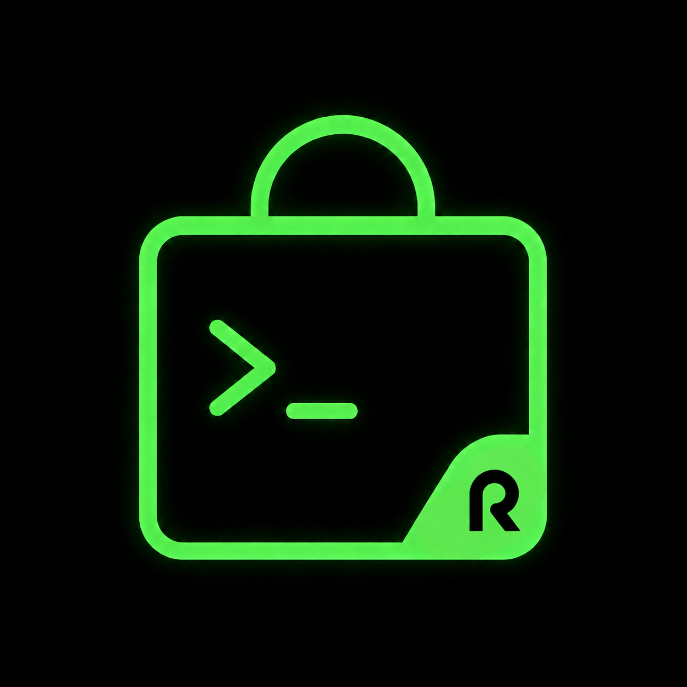
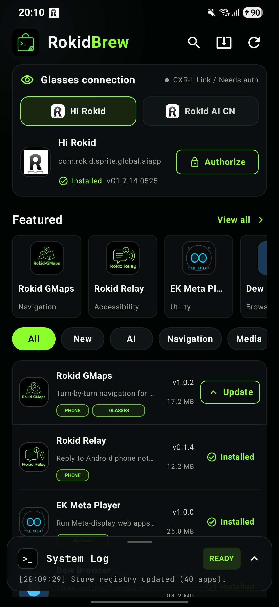
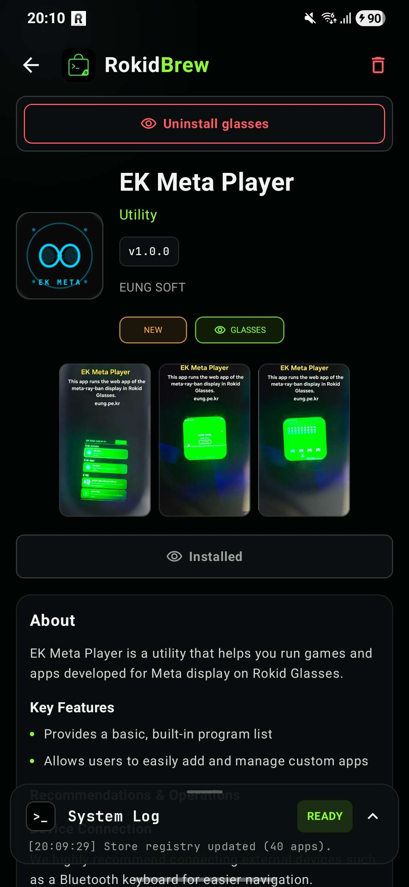

<p align="center">
  
</p>

# RokidBrew

Community app store for [Rokid AR glasses](https://www.rokid.com). Browse, install, and update community-made apps — directly from your phone.

[](https://github.com/Anezium/RokidBrew)
[](https://kotlinlang.org/)
[](https://developer.android.com/compose)

<p align="center">
  <a href="https://ko-fi.com/M8R61ZTXMI" target="_blank">
    
  </a>
</p>

<p align="center">
  
  
</p>

## Download

Get the latest APK from [GitHub Releases](https://github.com/Anezium/RokidBrew/releases/latest).

Current release: [RokidBrew v0.1.8](https://github.com/Anezium/RokidBrew/releases/tag/v0.1.8).

## What it does

- **Browse 31+ community apps** for Rokid glasses — AI assistants, navigation HUDs, games, launchers, translators, and more.
- **Install phone APKs** locally on your Android device.
- **Push glasses APKs** to your Rokid glasses via CXR-L / the selected Rokid host app.
- **Combo apps** — apps that need both a phone and glasses APK get a single install flow.
- **Track phone install status** and detect available phone updates.
- **Track glasses installs after RokidBrew installs them** without auto-scanning every glasses package.
- **Self-updating** — the store checks for new versions on every refresh.


## How it works

```
┌─────────────────────┐          HTTP GET            ┌──────────────────────────┐
│   RokidBrew (Phone) │ ──────────────────────────► │ RokidBrew-Registry        │
│   Android App        │ ◄────────────────────────── │ dist/apps.v1.json         │
└─────────────────────┘          (JSON manifest)     └──────────────────────────┘
```

The app loads a cached manifest on startup, then refreshes from the hosted registry in the background. The registry is maintained in a separate repo — new apps can be added without shipping APK updates.

**[RokidBrew-Registry →](https://github.com/Anezium/RokidBrew-Registry)**

## Requirements

- Android 9+ (API 28)
- **Hi Rokid Global** (`com.rokid.sprite.global.aiapp`) or **Rokid AI CN** (`com.rokid.sprite.aiapp`) installed on your phone for glasses-side APK installs
- Bluetooth pairing between phone and glasses
- Phone Wi-Fi enabled during glasses installs

## Known CXR-L limitations

RokidBrew uses the public CXR-L bridge exposed by the selected Rokid host app. Global Hi Rokid remains the default; Rokid AI CN can be selected in the app for China-region testing. In the current `client-l` SDK, the glasses app-status API only exposes package-by-package checks:

```kotlin
queryGlassAppInstalled(packageName, callback)
```

There is no public "list all installed glasses apps" API in this SDK. Because of that, RokidBrew does not auto-scan every package in the registry after authorization. Doing so requires repeatedly binding/querying through Hi Rokid, and on Global Hi Rokid `G1.6.14.0428` this triggered a crash loop in `CXRLinkService.onDestroy()` after the authorization token was received.

Current behavior:

- Authorization only stores the selected host app token.
- Glasses APKs can still be pushed and installed through CXR-L.
- RokidBrew marks glasses apps as installed after a successful RokidBrew install.
- Full glasses-side installed-app discovery would require a small companion/helper running on the glasses that can call Android `PackageManager` locally and send the package list back to the phone.

## Build

```powershell
$env:JAVA_HOME='C:\Program Files\Java\jdk-22'
.\gradlew assembleDebug
```

Output: `phone-app/build/outputs/apk/debug/phone-app-debug.apk`

## Project structure

```
RokidBrew/
├── phone-app/        Android phone store app (Kotlin + Jetpack Compose + CXR-L SDK)
├── docs/             Architecture docs
└── dist/             Built APKs
```

## Credits

Built on top of the Rokid CXR-L SDK (`client-l`). Registry powered by the community at [RokidBrew-Registry](https://github.com/Anezium/RokidBrew-Registry).
